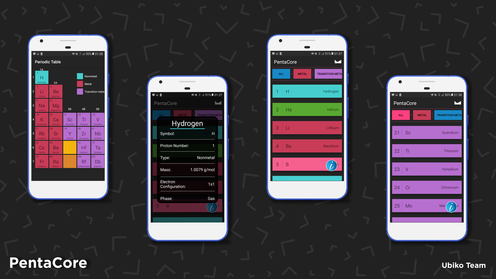

# PentaCore

## **PentaCore Nedir?**
TUBITAK için yapılan Pentacore projesi, interaktif bir periyodik tablo uygulamasıdır.

## **PentaCore Kimlere Hitap Ediyor?**
PentaCore, ortaokul ve lise öğrencilerine hitap ederken aynı zamanda bir periyodik cetvel rehberi olarak da kullanabilecek kompleks parçaları içermektedir.

## **Ubiko Team Nedir?**
Ubiko Team 2018 yılında kurulmuş olup 2019'da çalışmalarını sürdüren bir yazılım ekibidir. **PentaCore** adlı uygulamanın ardından geliştirici ve tasarımcılar yollarını ayırmıştır. 

## **PentaCore'da Görev Alanlar?**
- **Ömer Ayyıldız - Proje Kaptanı**
- **Kadir Şahin - Tasarımcı Ve Uygulama Kaptanı**
- **Faruk Emre Ekşioğlu - Mobil Geliştirici**
- **Emir Can Yılmaz - PentaCore Desktop pre-Alpha Geliştiricisi**

